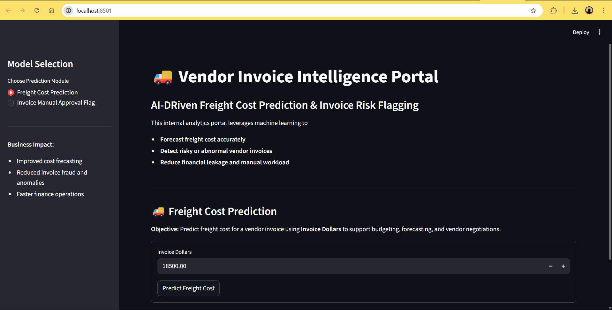
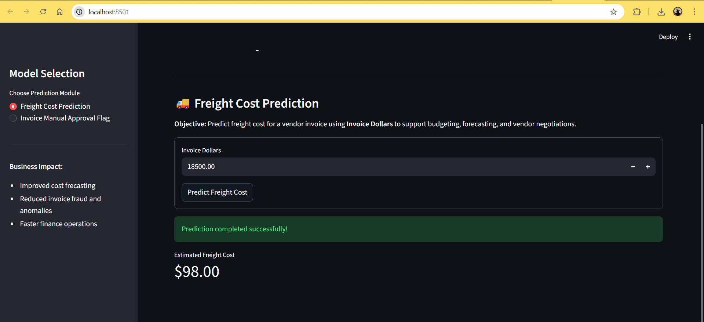
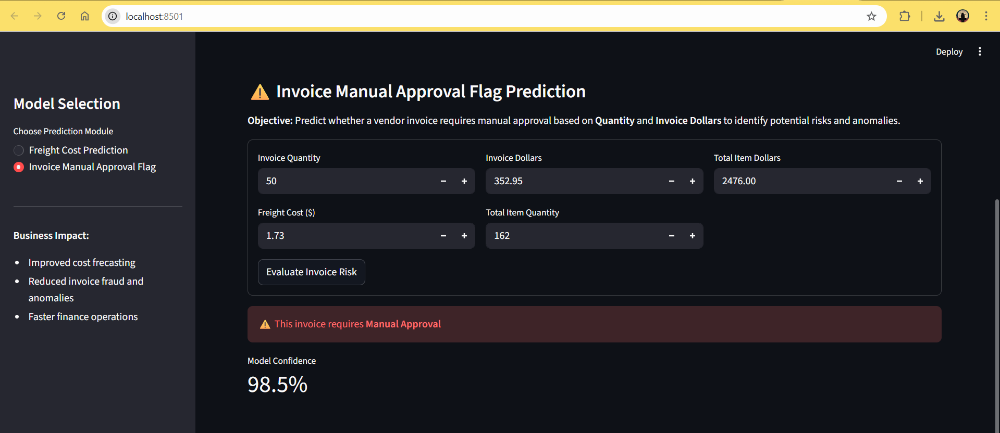

# Vendor Invoice Intelligence System

**AI-Powered Freight Cost Prediction & Invoice Risk Detection**

[](https://mayuresh0711-vendor-invoice-intelligence-system-app-sszyjb.streamlit.app/)
[]()

---

## 📌 Overview

This system helps finance teams automatically:
1. **Predict freight costs** – Estimate fair shipping costs for vendor invoices
2. **Flag risky invoices** – Detect anomalies and suspicious patterns

Built with **Machine Learning** and deployed on **Streamlit**.

---

## 🎯 Business Problem

Finance teams spend hours manually reviewing vendor invoices to detect:
- **Freight overcharging** – Abnormally high shipping costs
- **Invoice anomalies** – Mismatches between invoice and purchase orders
- **Fraudulent patterns** – Suspicious quantity or pricing discrepancies

**This system automates that process**, enabling faster approvals and reducing financial leakage.

---

## 🔑 Key Features

- 🧠 **Regression Model** – Predicts freight costs with 97% accuracy
- 🚨 **Classification Model** – Identifies risky invoices with 89% accuracy  
- 🖥️ **Interactive Web App** – User-friendly interface for instant predictions
- 📊 **Confidence Scores** – Model confidence level for each prediction
- 🚀 **Deployed & Live** – Ready to use on Streamlit Cloud

---

## 🚀 Live Demo

**Try it here:** [https://mayuresh0711-vendor-invoice-intelligence-system-app-sszyjb.streamlit.app/](https://mayuresh0711-vendor-invoice-intelligence-system-app-sszyjb.streamlit.app/)

### Screenshots

**Homepage**


**Freight Cost Prediction**


**Invoice Risk Flagging**


---

## 💡 How It Works

### Model 1: Freight Cost Prediction (Regression)
**Problem:** How do we know if a freight charge is fair?

- **Input:** Invoice quantity & total amount
- **Output:** Expected freight cost based on historical patterns
- **Business Impact:** If actual freight is 30%+ higher than predicted, it may indicate overcharging
- **Example:** Invoice of $18,500 → Predicted freight: $1,120 → If billed $1,500+, it's flagged

### Model 2: Invoice Risk Flagging (Classification)  
**Problem:** Which invoices need manual review before payment?

- **Input:** Invoice quantity, amount, freight, total purchase details
- **Output:** "Safe to Auto-Approve" OR "Requires Manual Review" with confidence score
- **Business Impact:** Prioritizes high-risk invoices for auditor attention, reducing fraud/errors
- **Detects:** Amount mismatches, unusual freight ratios, suspicious patterns
- **Example:** Invoice $2,468 vs Purchase Total $2,476 → Large variance → Flagged

---

## 📊 Data & Training

**Data Source:** SQLite database with vendor invoices and purchase order data

**Features Used:**
- Invoice quantity, amount, freight cost
- Purchase order quantities and totals
- Receiving performance metrics

**Models:**
- Freight prediction: Random Forest Regressor (tested Linear Regression & Decision Tree)
- Risk flagging: Random Forest Classifier with feature scaling

---

## 📊 Model Performance

| Model | Metric | Value |
|-------|--------|-------|
| **Freight Prediction** | MAE | 24.11 |
| | R² Score | 96.99% |
| **Risk Flagging** | Accuracy | 89% |
| | F1-Score | 87% |

---

## 🏗️ Project Workflow

```
1. DATA LOADING → SQLite database
   ↓
2. PREPROCESSING → Handle missing values, feature engineering
   ↓
3. MODEL TRAINING → Regression & Classification models
   ↓
4. EVALUATION → Test performance metrics
   ↓
5. SERIALIZATION → Save models as .pkl files
   ↓
6. INFERENCE API → predict_freight.py & predict_invoice_flag.py
   ↓
7. STREAMLIT APP → Interactive user interface
   ↓
8. LIVE DEPLOYMENT → Streamlit Cloud
```

---

## 📁 Project Structure

```
├── Data/
│   └── inventory.db                    # Source data (SQLite)
├── freight_cost_prediction/
│   ├── data_preprocessing.py
│   ├── modeling_evaluation.py
│   ├── train.py
│   └── models/predict_freight_model.pkl
├── invoice_flagging/
│   ├── data_preprocessing.py
│   ├── modeling_evaluation.py
│   ├── train.py
│   └── models/predict_flag_invoice.pkl
├── inference/
│   ├── predict_freight.py
│   └── predict_invoice_flag.py
├── notebooks/                          # Jupyter exploration notebooks
├── app.py                              # Streamlit application
└── requirements.txt
```

---

## ⚡ Quick Start

### 1. Clone Repository
```bash
git clone https://github.com/mayuresh0711/vendor-invoice-intelligence-system.git
cd vendor-invoice-intelligence-system
```

### 2. Setup Environment
```bash
python -m venv venv

# Windows:
venv\Scripts\activate

# macOS/Linux:
source venv/bin/activate
```

### 3. Install Dependencies
```bash
pip install -r requirements.txt
```

### 4. Train Models (Optional)
```bash
python freight_cost_prediction/train.py
python invoice_flagging/train.py
```

### 5. Run Application
```bash
streamlit run app.py
```

Open: **http://localhost:8501**

---

## 🛠️ Technologies Used

- **Python** – Core language
- **scikit-learn** – Machine learning
- **Pandas & NumPy** – Data manipulation
- **Streamlit** – Web application
- **SQLite** – Database

---

## 📞 Contact

**Mayuresh Ahire**  
Data Analyst | Machine Learning

- 🔗 **LinkedIn:** [linkedin.com/in/mayuresh-ahire-ab079b2a3/](https://www.linkedin.com/in/mayuresh-ahire-ab079b2a3/)
- 🐙 **GitHub:** [github.com/mayuresh0711](https://github.com/mayuresh0711)
- 📧 **Email:** ahiremayuresh4@gmail.com

---

**Happy to connect! Feel free to reach out with feedback or collaboration ideas.** 🚀